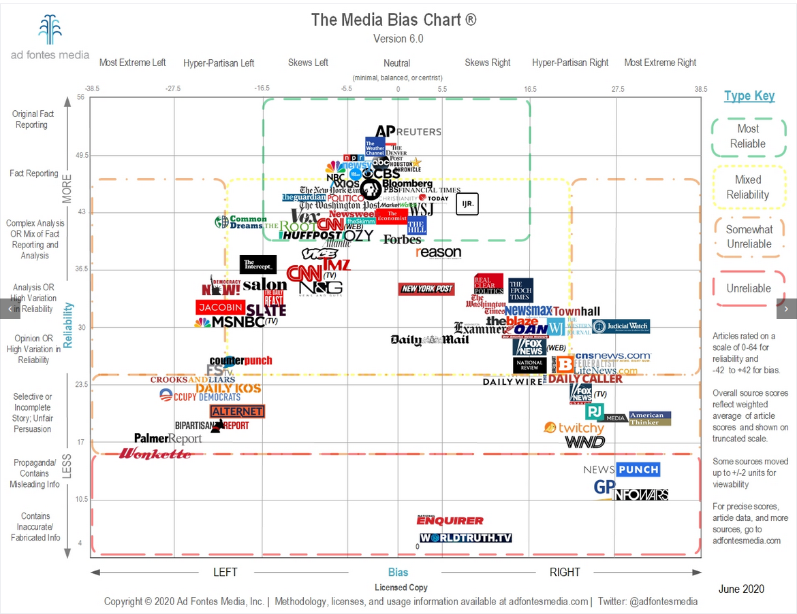

# Perspecitve (WIP)

## Goal
The Goal of this project is to build a website where you can find news that challenge your existing biases and believes in order for everyone to break out of their news bubble and in the end to foster understanding of opposing political views.

## Website
In order to achieve this goal, a website will be built which, first detects roughly your existing political standing and then presents you with news articles from the other side of the spectrum.
These articles can be searched and you can freely choose if you want to see news from a more politically left or right sided view.
The media bias chart found from [adfontesmedia](https://www.adfontesmedia.com/download-the-media-bias-chart/) will be used to categorise the different websites. Afterwards, I will do my best to categorise otherwise that are not found in this chart, myself.

RSS Links:
https://www.uen.org/feeds/lists.shtml

### Todo:
- Searchable
- add Sources:
  - MSNBC
  - Washington monthly
  - Busniess insider
  - Washington times
  - Fox news
  - CNSNEWS.com
- Make slider actually do something
- Add bias "quiz" intiall based on personal news sources
- Make availble in US & CH

### Smaller Todos
- correct shrinking of bars left & right
