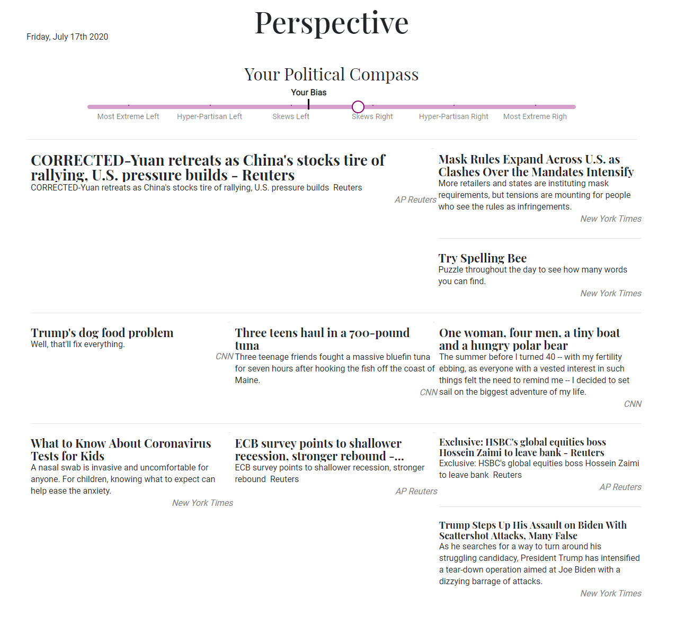
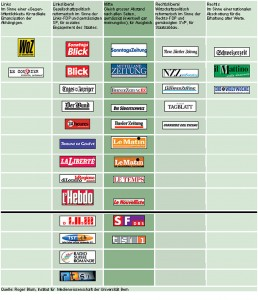

# :newspaper: Perspecitve.news

## Goal
The Goal of this project is to build a website where you can find news that challenge your existing biases and believes in order for everyone to break out of their news bubble and in the end to foster understanding of opposing political views.

## Website

### [Accessible here](https://perspective.news)
Website might be temporarily down

In order to achieve this goal, a website will be built which, first detects roughly your existing political standing and then presents you with news articles from the other side of the spectrum.
These articles can be searched and you can freely choose if you want to see news from a more politically left or right sided view.
The media bias chart found from [adfontesmedia](https://www.adfontesmedia.com/download-the-media-bias-chart/) will be used to categorise the different websites for the US and for Switzerland the one found below will be used.

| Media Chart USA | Media Chart Switzerland     |
| :------------- | :------------- |
|   |        |

### Todo:
- add Sources:
  - US:
    - MSNBC
    - Washington monthly
    - Business insider
    - Washington times
    - Fox news
    - CNSNEWS.com
  - CH:
    - all of them
- Location selectable
  - language selectable
